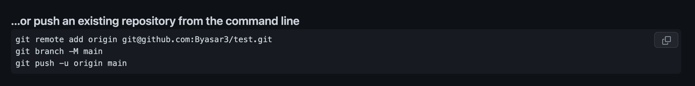

# ✨Cheat Sheet✨ for using Terminal, Git, GitHub and Markdown.

## Terminal
- Open terminal using cmd+spacebar and search terminal.
- The main bits and bobs have already been installed, so lets get straight into the commands:

| Command name | What it does |
| ----------- | ----------- |
|`pwd` | Tells you what file you're currently in the the file pathway|
|`ls` | Gives you a list of all the folders (in blue) and files (in white) of the directo*ry you're currently in |
|`la -a` | `-a` acts as a 'flag' to the `ls` command and gives you a list of ALL folders and files, **including hidden ones**|
|`ls -l` | `-l` acts as a 'flag' to the `ls` command and gives you information on the files and folders|
|`ls -al`|Can combine flags to give multiple results: `-al` gives results of both `-a` and `-l`|
|`cd [directory name]`|Allows you to change the directory you're 'in'|
|`cd` | On its own, `cd` takes you directly back to the home directory |
|`.`|Current directory|
|`..`|Parent directory (the 'above' folder that the file/folder is in)|
|`mkdir [directory name]`|Makes a directory|
|`touch [file name]`|Creates a file|
|`open`|Opens a file|
|`code .`|Opens a file in VScode|
|`mv [file/folder name] [directory name]`|This moves the directory that is named into the directory that is named (can also use `..` for directory name, to move to parent directory)|
|`mv [file name] [new file name]`| Can also use the move command to rename a file. The [new file name] overrides the [file name]|
|`rm [file/folder]`|Delete command. **Does NOT send to bin, it is permanently deleted.**  |
|`rm -r`|`-r` is another 'flag' that deletes everything in the directory|
|`rm -rf`|Basically deletes everything in its path with no care for consequences. **DO NOT USE**|
|`history`|Command to show you all your previous commands|

- notes, tips and tricks:
    1. > Creating a txt file is `.txt` at end of file name
    2. > Creating a markdown file is `.md` at end of file name
    3. > **no white spaces in file names**
    4. >Clicking ↑ arrow on keyboard shows previous command. Continue clicking to go further back. Can click ↓ to move foward again to the command wanted.
    5. >Pressing command+l gives white space between lines.

## Git

Git is installed and maintained on your local system. It is seperate from github.

- Once a file has been made and `code .` is executed and the file has been opened in VScode, open a new Terminal in VScode.
- Using the terminal in VScode, there are a number of commands possible:

| Command name | What it does |
| ----------- | ----------- |
|`git add .`|This command adds a change in the working directory to the stageing area. This does not save the changes made.|
|`git commit -m"[text]"`|This command saves the changes made to the directory. [text] is a description of the changes made to the directory.|
|`git status`|Tells you if there is anything to commit|
|`git push`|This publishes/pushes everything you've commited to GitHub|

## GitHub
GitHub is a hosting and sharing service for Git repositories. It is ☁️ based. 

- First make a repository on GitHub:
>Profile -> Your Repositories -> New -> Add name -> Create Repository
- Then copy the code 'push an existing repository from the command line' **make sure its SSH**

- Paste this code into termninal of VScode, this should connect the local Git file to GitHub.
- To then publish in GitHub, run the command `git push`

## Markdown
It's sort of an enhanced txt file, but not exactly html type advanced.

### Syntax and examples:

 

    Headings:
    # H1
    ## H2
    ### H3
    #### H4
    ##### H5
    ###### H6
# H1 
## H2
### H3
#### H4
##### H5
###### H6
 

    Bold:
    **bold**
**bold**

    Italics:
    *italics*
*Italics*

    Strike through
    ~~strike~~
~~Strike~~

    Blockquote
    >This is quote!
>This is quote! 

    Unordered List
    - Text
    - Text Again
    - Text Yet again
- Text
- Text Again
- Text Yet Again

 

    Ordered Text
    1. First
    2. Second 
    3. Third
1. First
2. Second
3. Third

 

    Code text
    `here is some code`
`here is some code`

    Horizontal Lines
    ---
    
---

 
    
    Link 
    [Title](url)
    [Google](www.google.com)
[Google](www.gogole.com)

    Images
    
    

    Table: 
    | Syntax | Description |
    | ----------- | ----------- |
    | Header | Title |
    | Paragraph | Text |
| Syntax | Description |
| ----------- | ----------- |
| Header | Title |
| Paragraph | Text |

    Creating a breakline:
     
    This is sentence one   This is sentence two
This is sentence one   This is sentence two

